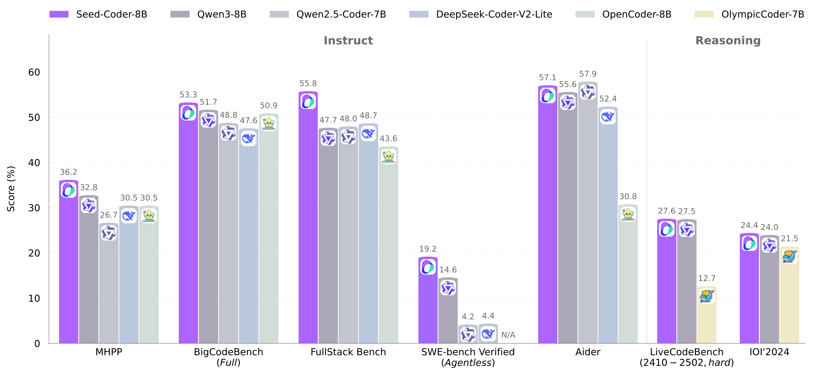

#  Seed-Coder: Let the Code Model Curate Data for Itself

<p align="center">
🌐 <a href="https://bytedance-seed-coder.github.io/"> Homepage</a>&nbsp&nbsp | &nbsp&nbsp🤗 <a href="https://huggingface.co/collections/ByteDance-Seed/seed-coder-680de32c15ead6555c75b0e4">Hugging Face</a>&nbsp&nbsp | &nbsp&nbsp📄 <a href="https://arxiv.org/abs/.....">arXiv (upcoming)</a>
</p>

We are thrilled to introduce **Seed-Coder** (previously known as Doubao-Coder), a family of lightweight yet powerful open-source code LLMs comprising base, instruct and reasoning models of 8B size. 

Seed-Coder demonstrates that, with minimal human effort, LLMs can effectively curate code training data by themselves to drastically enhance coding capabilities.

Seed-Coder represents our initial step towards contributing to the open-source LLM ecosystem. We look forward to seeing Seed-Coder drive advances in code intelligence and empower broader applications in the open-source LLM community!

## 📢 News

[2025/05/08]🔥 We release [Seed-Coder](https://bytedance-seed-coder.github.io)!
[2025/05/14] We found an inconsistent setting of our BigCodeBench evaluation results. We already updated all the results with the aligned BigCodeBench-Completion setting.

## 🌟 Highlights
- **Model-centric:** Seed-Coder predominantly leverages LLMs instead of hand-crafted rules for code data filtering, minimizing manual effort in pretraining data construction.

- **Transparent:** We openly share detailed insights into our model-centric data pipeline, including methods for curating GitHub data, commits data, and code-related web data.

- **Powerful:** Seed-Coder achieves state-of-the-art performance among open-source models of comparable size across a diverse range of coding tasks.

## ⚡ Quick Start
We are excited to introduce **Seed-Coder**, featuring three powerful models:

| Model Name                  | Length | Download                                                                           |   Notes  |
|-----------------------------|--------|------------------------------------------------------------------------------------|---------------|
| Seed-Coder-8B-Base          | 32K    | 🤗 [Model](https://huggingface.co/ByteDance-Seed/Seed-Coder-8B-Base)        |  Pretrained on our model-centric code data. |
| Seed-Coder-8B-Instruct      | 32K    | 🤗 [Model](https://huggingface.co/ByteDance-Seed/Seed-Coder-8B-Instruct)    |  Instruction-tuned for alignment with user intent.  |
| Seed-Coder-8B-Reasoning     | 32K    | 🤗 [Model](https://huggingface.co/ByteDance-Seed/Seed-Coder-8B-Reasoning)   |  RL trained to boost reasoning capabilities. |

All the models are publicly available on [Hugging Face collection](https://huggingface.co/collections/ByteDance-Seed/seed-coder-680de32c15ead6555c75b0e4).  

### 👉🏻 Deploying Seed-Coder-8B-Instruct with `transformers`

```python
from transformers import AutoTokenizer, AutoModelForCausalLM
import torch

model_id = "ByteDance-Seed/Seed-Coder-8B-Instruct"

tokenizer = AutoTokenizer.from_pretrained(model_id, trust_remote_code=True)
model = AutoModelForCausalLM.from_pretrained(model_id, torch_dtype=torch.bfloat16, device_map="auto", trust_remote_code=True)

messages = [
    {"role": "user", "content": "Write a quick sort algorithm."},
]

input_ids = tokenizer.apply_chat_template(
    messages,
    tokenize=True,
    return_tensors="pt",
    add_generation_prompt=True,  
).to(model.device)

outputs = model.generate(input_ids, max_new_tokens=512)
response = tokenizer.decode(outputs[0][input_ids.shape[-1]:], skip_special_tokens=True)
print(response)
```

For more detailed usage instructions and model-specific configurations, please refer to the Hugging Face model pages linked above.

### 👉🏻 Deploying Seed-Coder-8B-Instruct with `vLLM`
As part of the new generation of code models, **Seed-Coder-8B-Instruct** is fully supported by [vLLM](https://vllm.ai/). A detailed tutorial can be found in the vLLM documentation.

Here, we provide a simple example for offline batched inference using vLLM.

#### Offline Batched Inference
```python
from transformers import AutoTokenizer
from vllm import LLM, SamplingParams
# Initialize the tokenizer
tokenizer = AutoTokenizer.from_pretrained("ByteDance-Seed/Seed-Coder-8B-Instruct")

# Pass the default decoding hyperparameters of Seed-Coder-8B-Instruct
# max_tokens is for the maximum length for generation.
sampling_params = SamplingParams(temperature=0.6, top_p=0.8, repetition_penalty=1.05, max_tokens=512)

# Input the model name or path. Can be GPTQ or AWQ models.
llm = LLM(model="ByteDance-Seed/Seed-Coder-8B-Instruct")

# Prepare your prompts
prompt = "#write a quick sort algorithm."

# generate outputs
outputs = llm.generate([prompt], sampling_params)

# Print the outputs.
for output in outputs:
    prompt = output.prompt
    generated_text = output.outputs[0].text
    print(f"Prompt: {prompt!r}\n\nGenerated content: {generated_text!r}")
```

#### Multi-GPU Distributed Serving
To further boost the serving throughput, **distributed inference** is supported by leveraging multiple GPU devices.

When handling long-context inputs (up to 32K tokens), tensor parallelism can help mitigate GPU memory limitations.  

Here is how to run **Seed-Coder-8B-Instruct** with tensor parallelism:

```python
llm = LLM(model="ByteDance-Seed/Seed-Coder-8B-Instruct", tensor_parallel_size=8)
```

## 🏆 Performance
We evaluated Seed-Coder across a wide range of coding benchmarks, including code generation, code completion, code editing, code reasoning, and software engineering tasks.

Seed-Coder achieves state-of-the-art performance among open-source models at the 8B scale, and even surpasses some much larger models.



For detailed benchmark results and analysis, please refer to our [Technical Report](./Seed-Coder.pdf).

<!-- ## 📖 Citation
If you find Seed-Coder useful for your research and applications, feel free to give us a star ⭐ or cite us using:

```bibtex
@article{bytedance2025seedcoder,
    title={Seed-Coder: Let the Code Model Curate Data for Itself},
    author={Xxx},
    year={2025},
    eprint={2504.xxxxx},
    archivePrefix={arXiv},
    primaryClass={cs.CL},
    url={https://arxiv.org/abs/xxxx.xxxxx}, 
}
``` -->

## 📜 License
This project is licensed under MIT License. See the [LICENSE](./LICENSE) file for details.

## 🏢 About [ByteDance Seed Team](https://seed.bytedance.com/)

Founded in 2023, ByteDance Seed Team is dedicated to crafting the industry's most advanced AI foundation models. The team aspires to become a world-class research team and make significant contributions to the advancement of science and society.
